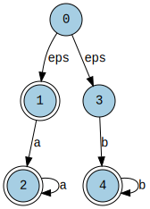
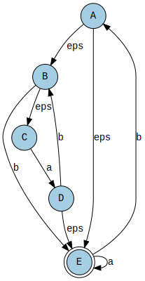
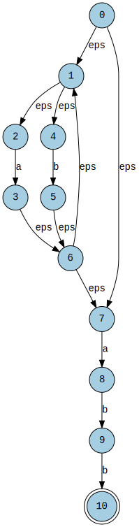
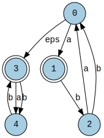

# subsetConstruction
Implementation of the subset constructionin C++ using the Graphviz library.

Requirements:
- graphviz
- graphviz-dev
- graphviz-doc
- libgraphviz-dev.

To compile use:
g++ subsetConstruction.cpp -o subsetConstruction.out -lgvc -lcgraph -fpermissive -O3 -w

For some reason it doesn't work well under Windows

